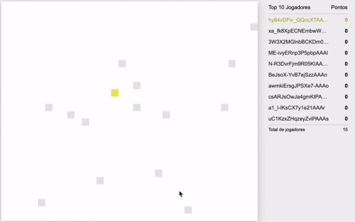

<h1 align="center">
    <b> :video_game: Meu primeiro jogo multiplayer :video_game: </b> 
</h1>

<p align="center">
  
</p>


## :fire: Sobre

Como o nome do repositório já diz, este é meu primeiro jogo multiplayer (baseado na série do [Felipe Deschamps](https://www.youtube.com/watch?v=0sTfIZvjYJk&amp;list=PLMdYygf53DP5SVQQrkKCVWDS0TwYLVitL)

<a id="documentacao"></a>

## :rocket: Tecnologias Utilizadas

O projeto foi desenvolvido utilizando as seguintes tecnologias

- JavaScript


## :tv: Amostra:

<h1 align="center">
    
</h1>

<a id="como-usar"></a>

## :fire: Como usar

1. Faça um clone :

```sh
  $ git clone https://github.com/KaioVBraga/primeiro-jogo-multiplayer.git
```

2. Para executar:

Abra o projeto no seu navegador.

<a id="como-contribuir"></a>

## :recycle: Como contribuir

- Faça um Fork desse repositório,
- Crie uma branch com a sua feature: `git checkout -b my-feature`
- Commit suas mudanças: `git commit -m 'feat: My new feature'`
- Push a sua branch: `git push origin my-feature`

## :memo: License

Esse projeto está sob a licença MIT. Veja o arquivo [LICENSE](LICENSE.md) para mais detalhes.

